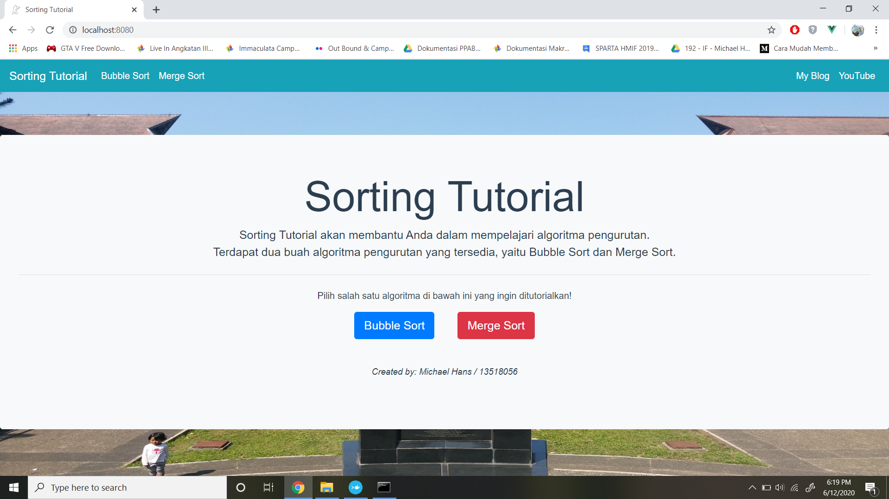
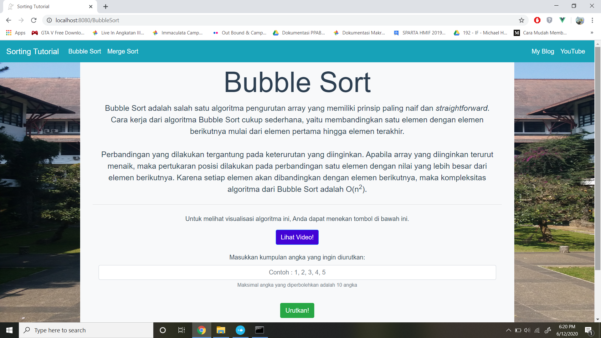
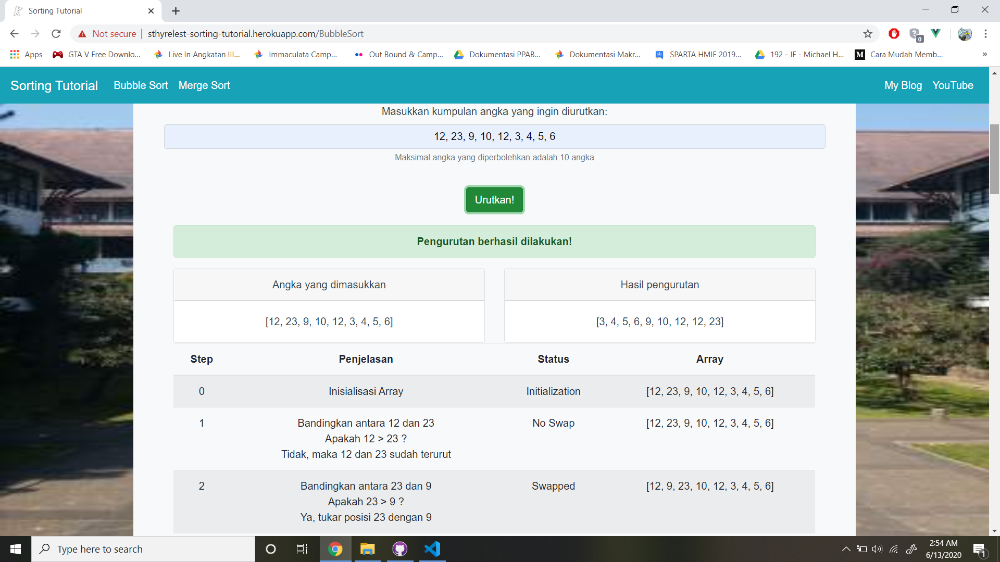

# Sorting-Tutorial

## Latar Belakang
Salah satu penerapan algoritma yang paling mudah adalah sorting. Saat ini sudah banyak algoritma untuk sorting yang telah dikembangkan di seluruh dunia. Untuk membantu orang - orang memahami berbagai algoritma sorting, tercetuslah ide untuk membuat sebuah website yang memberikan pemahaman mengenai algoritma sorting. Harapannya, website ini dapat dikembangkan lebih lanjut untuk pembelajaran strategi algoritma yang lain seperti Divide & Conquer, Dynamic Programming, dll

Sorting Tutorial akan memberikan ulasan dan ilustrasi dua buah algoritma sorting, yaitu:
- Bubble Sort
- Merge Sort

## Website Sorting Tutorial
<p align="center">
   
   <i>Gambar 1: Tampilan Home dari website Sthyrelest Sorting Tutorial</i>
</p>
Bonus berhasil dibuat dengan melakukan docker dan deploy website. Website Sorting Tutorial dapat diakses secara *online* pada laman berikut ini
http://sthyrelest-sorting-tutorial.herokuapp.com/

## Getting Started
Instruksi-instruksi berikut ini akan membimbing Anda dalam tahap instalasi aplikasi dan cara menjalankannya.

### Prerequisites
Berikut ini adalah persiapan environment yang dibutuhkan untuk menjalankan aplikasi berbasis web.
```
- Node.js untuk backend website
- Vue.js untuk frontend website dan framework
- Docker untuk menyimpan aplikasi website dalam container
- Heroku untuk menyediakan layanan website secara gratis
```

### Installing
Berikut ini adalah langkah-langkah dalam penginstallan aplikasi:
1. Install Node.js terlebih dahulu dengan mengunduh dan install dari laman berikut ini.
   ```
   https://nodejs.org/en/download/
   ```
2. Untuk melakukan proses deploying website, diperlukan aplikasi heroku yang dapat diunduh pada laman berikut ini.
   ```
   https://devcenter.heroku.com/articles/heroku-cli#download-and-install
   ```
3. Untuk menginstall Docker, lakukan pengunduhan Docker Toolbox terlebih dahulu dari laman berikut ini.
   ```
   https://github.com/docker/toolbox/releases
   ```

## How to Run Program
### 1. Deployed Website
Hasil aplikasi web sudah dideploy menggunakan aplikasi heroku. Anda bisa langsung menggunakan aplikasi web tersebut dengan mengunjungi
laman http://sthyrelest-sorting-tutorial.herokuapp.com/

### 2. Menjalankan secara lokal
Untuk menjalankan aplikasi web secara lokal, berikut ini adalah langkah-langkah dalam menjalankan aplikasi.
1. Lakukan instalasi project terlebih dahulu dengan menjalankan command berikut ini.
   ```
   npm install
   ```
2. Buka command prompt lalu jalankan command berikut ini.
   ```
   npm run serve
   ```
3. Setelah kompilasi berhasil, bukalah browser kemudian kunjungi laman berikut ini.
   ```
   localhost:8080
   ```
4. Selamat mencoba aplikasi Sorting Tutorial!

### 3. Menggunakan Docker
Untuk menjalankan aplikasi web menggunakan docker, berikut ini adalah langkah-langkah dalam menjalankan aplikasi.
1. Lakukan pembuatan image berdasarkan dockerfile yang tersedia dengan menjalankan command berikut ini.
   ```
   docker build -t sorting:latest .
   ```
2. Tunggu hingga pembuatan image berdasarkan dockerfile berhasil dibuat.
3. Untuk menjalankan docker image sorting:latest, jalankan command berikut ini.
   ```
   docker 
   ```
4. Untuk mengunjungi aplikasi web tersebut, cek terlebih dahulu IP address dari docker machine dengan mengetikkan command berikut ini.
   ```
   docker-machine ip default
   ```
5. Salin IP yang muncul dari command tersebut, kemudian jalankan browser dan kunjungi laman berikut ini. Misalkan IP yang muncul adalah 192.168.99.102, maka
   ```
   192.168.99.102:8080
   ```
6. Selamat mencoba aplikasi Sorting Tutorial!

## Guideline: How to Use
Berikut ini adalah cara menggunakan website Sorting Tutorial.
1. Pilih salah satu algoritma pengurutan yang diinginkan.<br>
   - Bubble Sort<br>
   - Merge Sort<br>
2. Masukkan angka-angka yang ingin diproses. Maksimal banyak angka yang diperbolehkan adalah 10.
3. Tekan tombol "Urutkan!" untuk memulai proses pengurutan.
4. Web akan menampilkan langkah per langkah proses pengurutan sesuai dengan algoritma yang dipilih.
5. Anda juga bisa melihat video ilustrasi masing-masing algoritma pengurutan pada tombol Lihat Video.
6. Bila ingin mengganti algoritma pengurutan, klik pada algoritma yang diinginkan pada tombol navigasi.

## Screenshot Aplikasi
<p align="center">
   
   <i>Gambar 2: Menu Algoritma Bubble Sort</i>
</p>
<p align="center">
   
   <i>Gambar 3: Menu Hasil Pengurutan Bubble Sort</i>
</p>

## Built With
* [Node.js](https://www.python.org/) - Back End dari Website
* [Vue.js](https://vuejs.org/) - Front End dan Router
* [Boostrap](https://bootstrap-vue.org/docs/components) - Front End Style and Components
* [Heroku](https://www.heroku.com/) - Deploy Website
* [Docker](https://github.com/docker/toolbox/releases) - Docker Website

## Referensi
1. Bootstrap VUE : https://bootstrap-vue.org/docs/components
2. Learn Vue.js - Full Course for Beginners - 2019 : https://www.youtube.com/watch?v=4deVCNJq3qc
3. Stackoverflow : https://stackoverflow.com/
4. Algoritma Divide and Conquer : https://informatika.stei.itb.ac.id/~rinaldi.munir/Stmik/2019-2020/Algoritma-Divide-and-Conquer-(2020).pdf
5. Bubble Sort : https://www.geeksforgeeks.org/bubble-sort/
6. Merge Sort : https://www.geeksforgeeks.org/merge-sort/
7. Dockerize Aplikasi Vue.js : https://nothinux.id/dockerize-aplikasi-vue-js/
8. How to Deploy a Vue CLI 3 Application to Heroku : https://www.youtube.com/watch?v=yfW9knTBR90&

## Author
**13518056 - Michael Hans** - *Designer, Programmer, and Tester*

## Acknowledgements
* Asisten IRK, Louis Cahyadi
