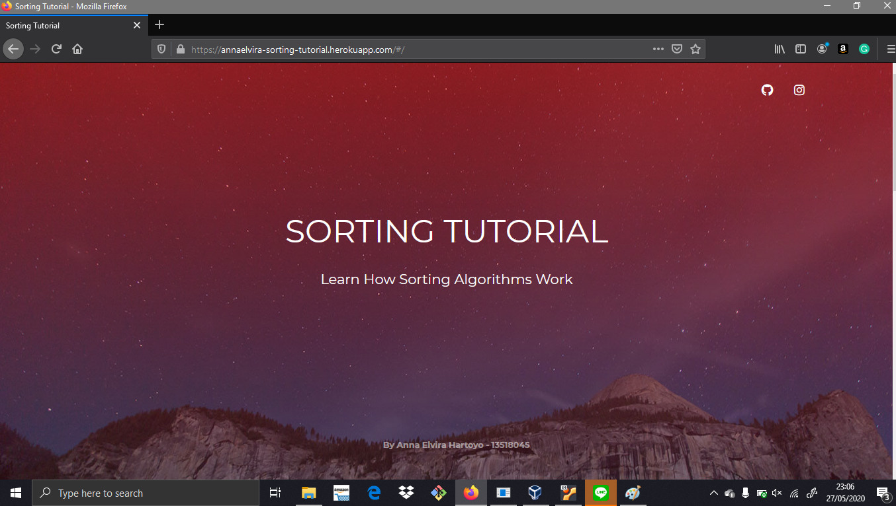
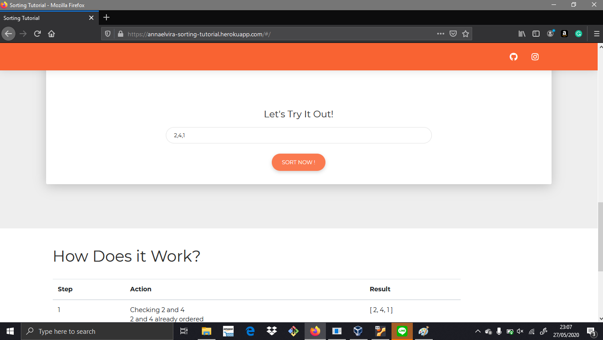

# Sorting-Tutorial
Berikut ini merupakan salah satu project yang menjadi bagian dari seleksi asisten IRK 2018
## Latar Belakang
Salah satu penerapan algoritma yang paling mudah adalah sorting. Saat ini sudah banyak algoritma untuk sorting yang telah dikembangkan di seluruh dunia. Untuk membantu orang - orang memahami berbagai algoritma sorting, tercetuslah ide untuk membuat sebuah website yang memberikan pemahaman mengenai algoritma sorting. Harapannya, website ini dapat dikembangkan lebih lanjut untuk pembelajaran strategi algoritma yang lain seperti Divide & Conquer, Dynamic Programming, dll
## Getting Started
### Prerequisites
* docker
* web browser
* python3

### Installation for **LINUX**
1. Buka terminal di directory server
2. Jalankan command berikut:
```
$ python3.7 -m venv env
$ source env/bin/activate
(env)$ pip install -r requirements.txt
(env)$ python app.py
```

3. Buka terminal di directory ini (root)
4. Jalankan command berikut:
```
$ docker build -t web:latest .
$ docker run -d --name flask-vue -e "PORT=8765" -p 8007:8765 web:latest
```
5. Buka broswer (disarankan chrome atau mozilla firefox)
6. Buka alamat http://localhost:8007/

## Testing
1. Pilih tab Bubble Sort atau Merge Sort
2. Masukkan angka (1 sampai 10 angka **integer**) pada field yang tersedia, angka dipisah dengan koma tanpa spasi.
```
Contoh:
3,1,-1,19
```
3. klik button SORT NOW!
4. Langkah-langkah sorting akan ditampilkan pada table di bawahnya. Sorting yang dilakukan adalah secara menaik atau ascending.

## Bonus Docker dan Deploy
Bonus berhasil dibuat, web yang sudah di-deploy dapat dilihat pada link berikut https://annaelvira-sorting-tutorial.herokuapp.com/ 

## Sample Screen



## Acknowledgement
Free vue components taken from https://www.creative-tim.com/product/vue-now-ui-kit 
