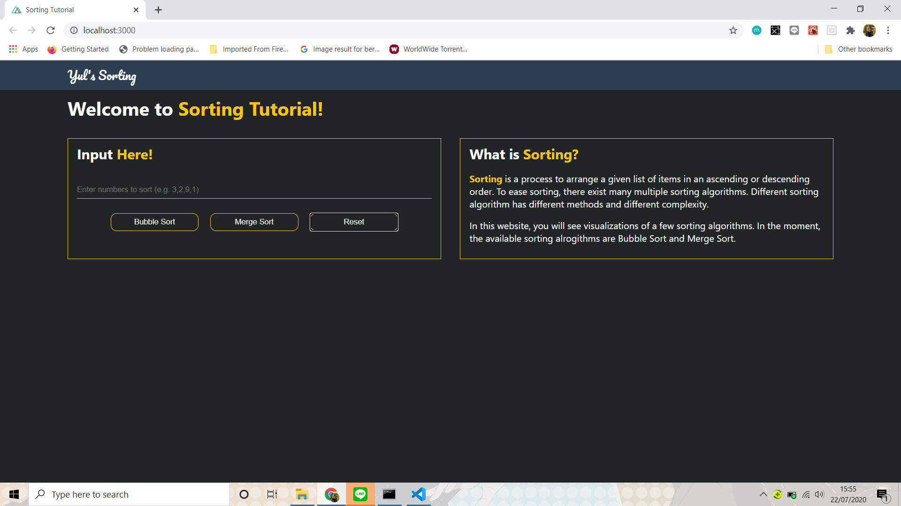
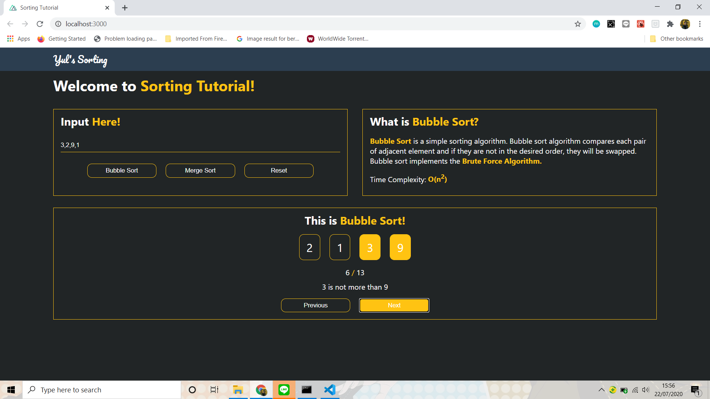
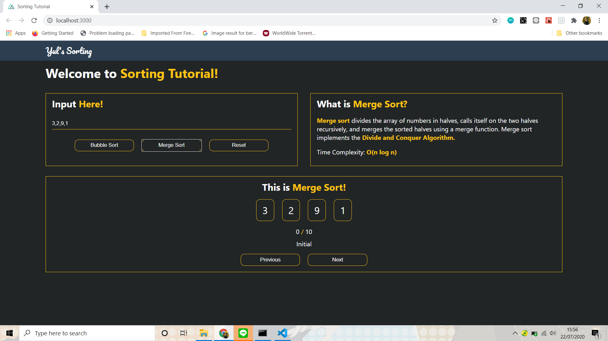

# Sorting-Tutorial
This is a project for the selection of IRK Laboratory Assistant 2018 in Informatics Engineering major in Institut Teknologi Bandung. <br>
This project is a visualization of various sorting algorithms. So far, the algorithms in this project are <b>Bubble Sort</b> and <b>Merge Sort</b>. <br>
This website is deployed on https://yul-sorting.herokuapp.com/

## Getting Started
To run this application in your computer locally, please follow the instructions stated below.

### Prerequisite
To run this program, please make sure you have <b>Node.js</b> installed on your computer. If you don't have it yet, you can go to this [link](nodejs.org/en/) to follow the installing instructions.

### Installing
Open the project's folder. In the root file, run this command in the CMD/terminal to make sure the project's dependencies are installed.
```
npm install
```

### Running App
After the dependencies have all been installed, run the following command in the CMD/terminal
```
npm run start
```
If the apps is ran successfully, the following message will pop-up on the CMD/terminal
```
Compiled successfully!

You can now view sorting-tutorial in the browser.

  Local:            http://localhost:3000        
  On Your Network:  http://192.168.0.8:3000      

Note that the development build is not optimized.
To create a production build, use npm run build. 
```
After that, just open `localhost:3000` in your web browser.

## Using the App
1. Input the numbers on the input field. Please mind that each number is separated by a comma, cannot be a negative value, and the maximum amount of inputted numbers is 10.
2. Choose your preferred sorting algorithm (you can change between each algorithms with the same numbers later)
3. Watch the each step and explanation provided.
4. If you want to change the numbers, click the reset button and repeat from step 1.

## Application Screenshots

<p align="center">Home Page</p>
<br>

<p align="center">Bubble Sort</p>
<br>

<p align="center">Merge Sort</p>
<br>

## Author
Ananda Yulizar Muhammad