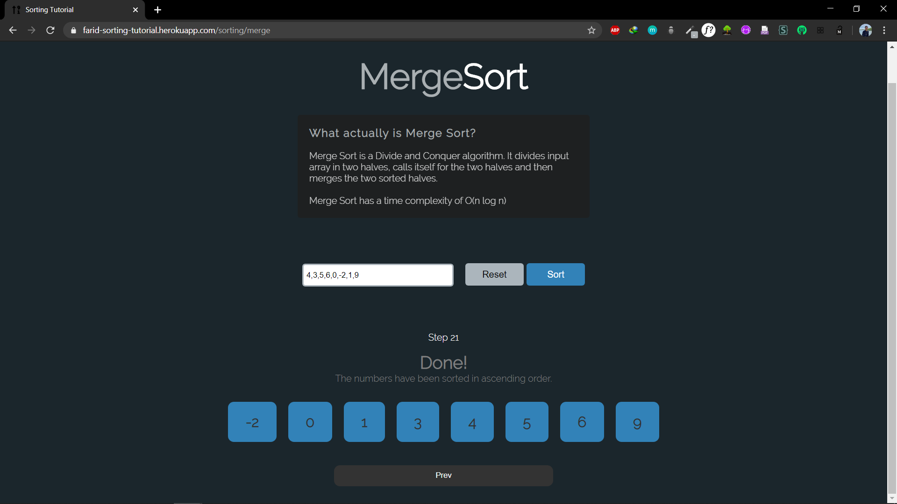
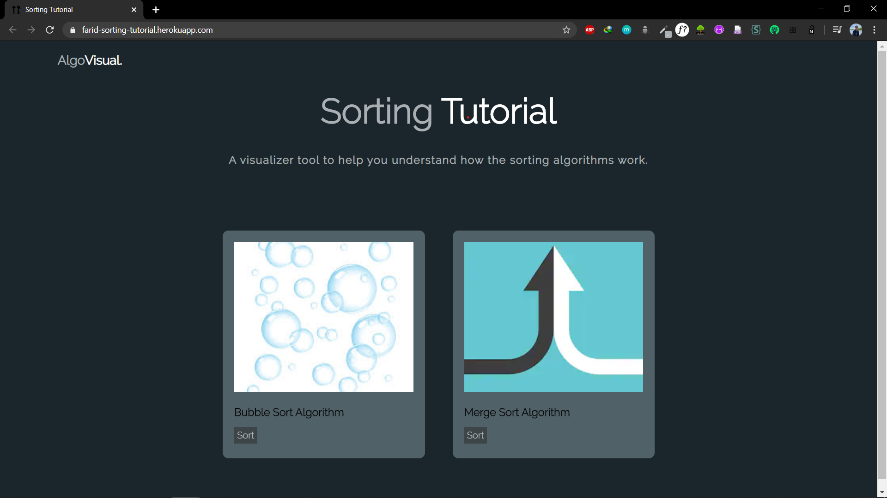

# Sorting-Tutorial
Project web visualisasi algoritma sorting untuk keperluan seleksi asisten IRK 2018

## Latar Belakang
Salah satu penerapan algoritma yang paling mudah adalah sorting. Saat ini sudah banyak algoritma untuk sorting yang telah dikembangkan di seluruh dunia. Untuk membantu orang - orang memahami berbagai algoritma sorting, tercetuslah ide untuk membuat sebuah website yang memberikan pemahaman mengenai algoritma sorting. Harapannya, website ini dapat dikembangkan lebih lanjut untuk pembelajaran strategi algoritma yang lain seperti Divide & Conquer, Dynamic Programming, dll

## Getting Started
### Prerequisites
* docker
* web browser
1. React.js
2. Node.js

### Cara Menjalankan Aplikasi

#### Menjalankan Service API (Backend)

1. Masuk ke folder `backend` melalui Terminal/CMD.
2. Menginstal package yang diperlukan pada package.json dengan perintah `yarn install` atau `npm install`
3. Ketikan `yarn start` atau `npm start`, untuk menjalankan server backendnya.
4. Tunggu hingga server berhasil berjalan.

#### Menjalankan Aplikasi (Frontend)

1. Masuk ke folder `frontend` melalui Terminal/CMD.
2. Menginstal package yang diperlukan pada package.json dengan perintah `yarn install` atau `npm install`.
3. Ketikan `yarn start` atau `npm start`, untuk menjalankan aplikasinya.
4. Setelah itu tunggu hingga proses berhasil.

##### Konfigurasi

1. Mengubah `PORT` pada backend server, yaitu dengan mengubah pada variabel `PORT` pada file `server.js` yang berada di folder `backend`

2. Mengubah `HOST API` pada frontend, yaitu dengan mengubah pada variabel `URL_API` pada file `Sorting.js` yang berada di folder

## Testing
1. Pilih tab Bubble Sort atau Merge Sort
2. Masukkan angka (1 sampai 10 angka **integer**) pada field yang tersedia, angka dipisah dengan koma tanpa spasi.
3. Untuk kembali ke menu awal, klik logo "AlgoVisual" sebelah pojok kiri atas halaman
### Contoh

## Website yang telah di deploy
Web yang sudah di deploy dapat dilihat pada link
https://farid-sorting-tutorial.herokuapp.com/

## Penyelesaian Bonus
Bonus berhasil diselesaikan dengan menggunakan docker dan deploy aplikasi ke heroku.
Dockerfile dan file docker-compose yang digunakan dapat dilihat pada root directory.

## Tampilan Website
Berikut tampilan homepage dari website Sorting Tutorial :

